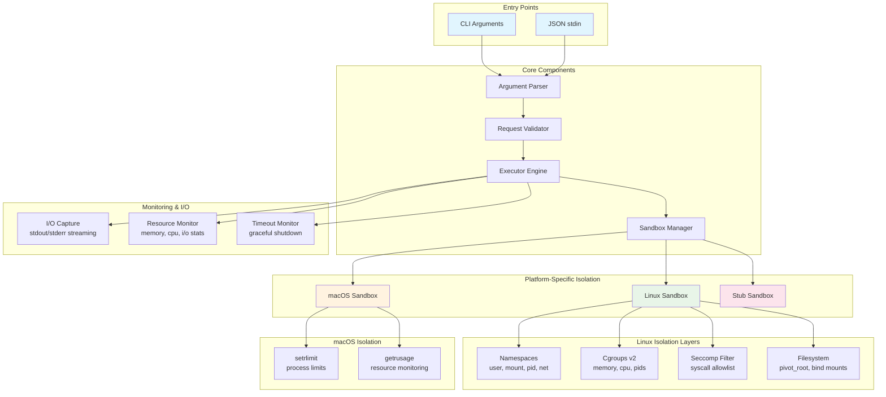
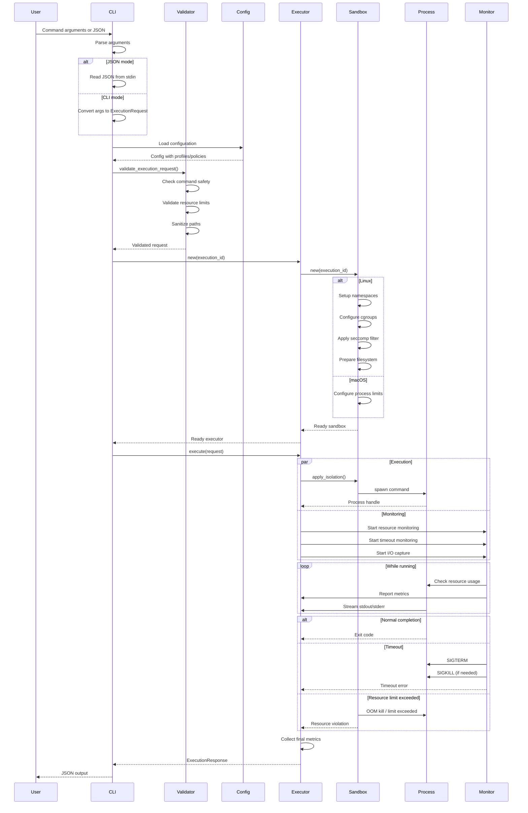
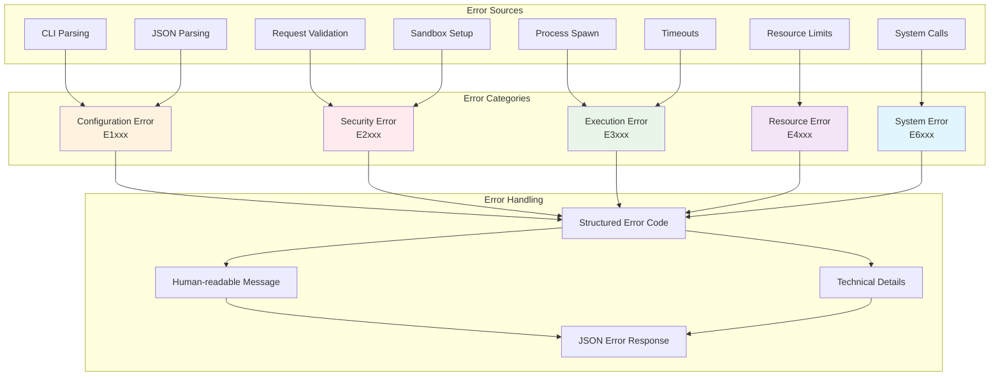
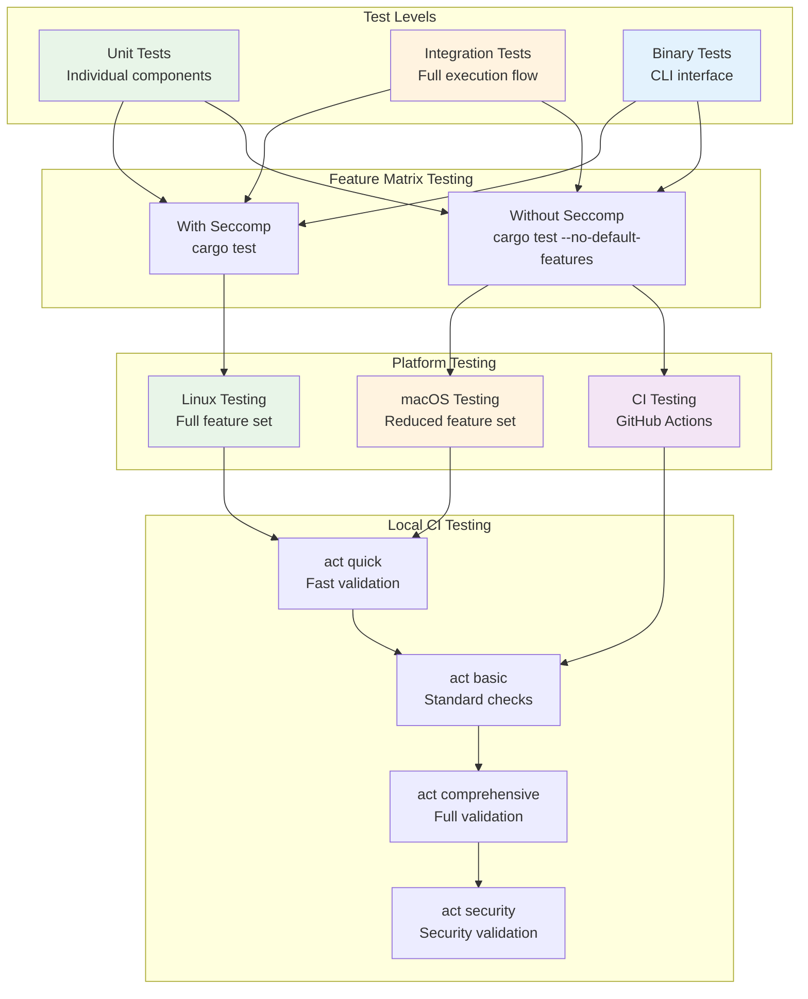

# Architecture Diagrams

This document contains detailed Mermaid diagrams illustrating the architecture and data flow of capsule-run.

## System Overview



## Request Processing Flow



## Platform-Specific Architecture

```mermaid
graph TB
    subgraph "Conditional Compilation"
        Target{Target OS}
    end
    
    subgraph "Linux Implementation"
        LinuxSandbox[Sandbox<br/>Linux]
        NamespaceManager[NamespaceManager<br/>unshare, clone]
        CgroupManager[CgroupManager<br/>cgroups v2 API]
        FilesystemManager[FilesystemManager<br/>mount, pivot_root]
        SeccompFilter[SeccompFilter<br/>libseccomp]
        
        LinuxSandbox --> NamespaceManager
        LinuxSandbox --> CgroupManager
        LinuxSandbox --> FilesystemManager
        LinuxSandbox --> SeccompFilter
    end
    
    subgraph "macOS Implementation"
        MacOSSandbox[Sandbox<br/>macOS]
        MacOSCore[MacOSSandbox<br/>setrlimit, getrusage]
        
        MacOSSandbox --> MacOSCore
    end
    
    subgraph "Stub Implementation"
        StubSandbox[Sandbox<br/>Other OS]
        StubComponents[Stub Components<br/>No-op implementations]
        
        StubSandbox --> StubComponents
    end
    
    subgraph "Feature Flags"
        SeccompFeature{seccomp feature}
        SeccompEnabled[Seccomp Enabled]
        SeccompDisabled[Seccomp Disabled]
    end
    
    Target -->|cfg(target_os = "linux")| LinuxSandbox
    Target -->|cfg(target_os = "macos")| MacOSSandbox
    Target -->|cfg(not(any(linux, macos)))| StubSandbox
    
    SeccompFeature -->|--features seccomp| SeccompEnabled
    SeccompFeature -->|--no-default-features| SeccompDisabled
    
    SeccompEnabled --> SeccompFilter
    SeccompDisabled -.-> SeccompFilter
    
    style LinuxSandbox fill:#e8f5e8
    style MacOSSandbox fill:#fff3e0
    style StubSandbox fill:#fce4ec
    style SeccompEnabled fill:#e8f5e8
    style SeccompDisabled fill:#ffebee
```

## Security Layers (Linux)

```mermaid
graph TD
    subgraph "Host System"
        HostUser[Host User<br/>UID 1000]
        HostFS[Host Filesystem<br/>/home, /usr, /etc]
        HostProcs[Host Processes<br/>PID namespace 0]
        HostNet[Host Network<br/>Full access]
    end
    
    subgraph "Container Process"
        ContainerRoot[Container Root<br/>UID 0 → mapped to UID 1000]
        ContainerFS[Container Filesystem<br/>pivot_root to /tmp/capsule-*]
        ContainerProcs[Container Processes<br/>PID namespace isolated]
        ContainerNet[Container Network<br/>No network access]
    end
    
    subgraph "Security Enforcement"
        UserNS[User Namespace<br/>UID/GID mapping]
        MountNS[Mount Namespace<br/>Filesystem isolation]
        PIDNS[PID Namespace<br/>Process isolation]
        NetNS[Network Namespace<br/>No network by default]
        Seccomp[Seccomp Filter<br/>~50 allowed syscalls]
        Cgroups[Cgroups v2<br/>Resource limits]
        Capabilities[Capability Drop<br/>All capabilities removed]
    end
    
    HostUser -.->|maps to| ContainerRoot
    HostFS -.->|isolated from| ContainerFS
    HostProcs -.->|isolated from| ContainerProcs
    HostNet -.->|blocked by| ContainerNet
    
    UserNS --> ContainerRoot
    MountNS --> ContainerFS
    PIDNS --> ContainerProcs
    NetNS --> ContainerNet
    
    Seccomp --> ContainerProcs
    Cgroups --> ContainerProcs
    Capabilities --> ContainerProcs
    
    style HostUser fill:#ffcdd2
    style HostFS fill:#ffcdd2
    style HostProcs fill:#ffcdd2
    style HostNet fill:#ffcdd2
    style ContainerRoot fill:#c8e6c9
    style ContainerFS fill:#c8e6c9
    style ContainerProcs fill:#c8e6c9
    style ContainerNet fill:#c8e6c9
```



## Resource Monitoring Flow

```mermaid
graph TB
    subgraph "Process Execution"
        SpawnedProcess[Spawned Process<br/>Command execution]
    end
    
    subgraph "Monitoring Threads"
        ResourceMonitor[Resource Monitor<br/>Memory, CPU tracking]
        TimeoutMonitor[Timeout Monitor<br/>Deadline enforcement]
        IOMonitor[I/O Monitor<br/>stdout/stderr capture]
    end
    
    subgraph "Data Sources"
        LinuxSources[Linux Sources]
        MacOSSources[macOS Sources]
        
        subgraph "Linux Data"
            ProcStat[/proc/PID/stat<br/>CPU times]
            ProcStatus[/proc/PID/status<br/>Memory usage]
            ProcIO[/proc/PID/io<br/>I/O statistics]
            CgroupMem[cgroup/memory.current<br/>Memory usage]
            CgroupEvents[cgroup/memory.events<br/>OOM events]
        end
        
        subgraph "macOS Data"
            GetRUsage[getrusage()<br/>CPU, memory]
            ProcInfo[proc_pidinfo()<br/>Advanced stats]
        end
    end
    
    subgraph "Metrics Collection"
        MetricsAggregator[Metrics Aggregator]
        ExecutionMetrics[Execution Metrics<br/>Peak memory, CPU time, I/O]
    end
    
    SpawnedProcess --> ResourceMonitor
    SpawnedProcess --> TimeoutMonitor
    SpawnedProcess --> IOMonitor
    
    ResourceMonitor --> LinuxSources
    ResourceMonitor --> MacOSSources
    
    LinuxSources --> ProcStat
    LinuxSources --> ProcStatus
    LinuxSources --> ProcIO
    LinuxSources --> CgroupMem
    LinuxSources --> CgroupEvents
    
    MacOSSources --> GetRUsage
    MacOSSources --> ProcInfo
    
    ProcStat --> MetricsAggregator
    ProcStatus --> MetricsAggregator
    ProcIO --> MetricsAggregator
    CgroupMem --> MetricsAggregator
    CgroupEvents --> MetricsAggregator
    GetRUsage --> MetricsAggregator
    ProcInfo --> MetricsAggregator
    
    MetricsAggregator --> ExecutionMetrics
    
    style SpawnedProcess fill:#e3f2fd
    style LinuxSources fill:#e8f5e8
    style MacOSSources fill:#fff3e0
    style ExecutionMetrics fill:#f3e5f5
```

## Error Handling Architecture



## Testing Strategy

